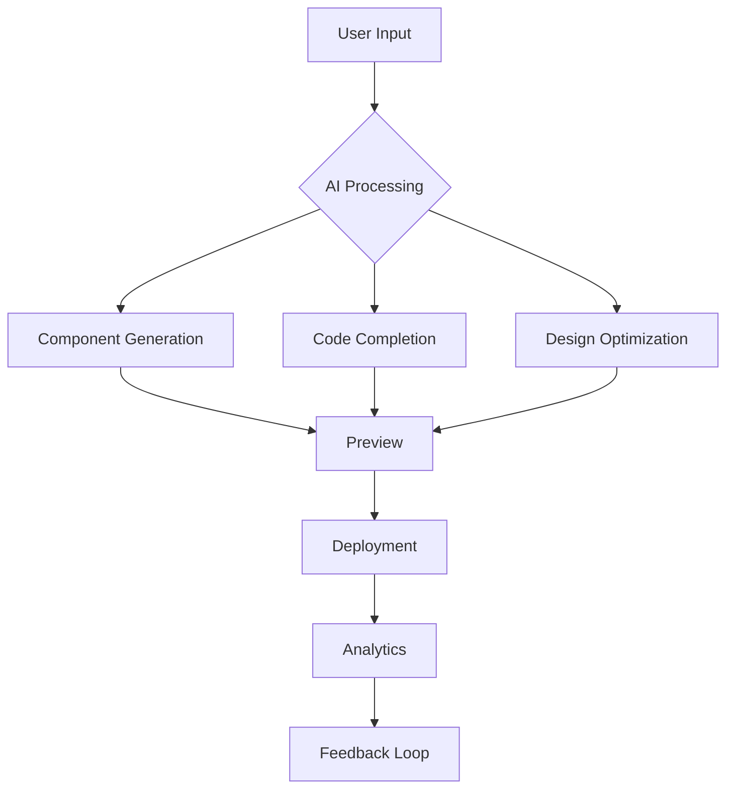

# Creation AI Platform

🌟 **Vision**

Creation AI is a revolutionary platform designed to empower developers with cutting-edge AI tools for front-end development. By integrating seamlessly with popular frameworks and offering unmatched flexibility, Creation AI aims to redefine the development workflow, making it faster, smarter, and more efficient.


🎯 **Why Creation AI?**

Creation AI stands out by combining the power of multiple AI models and frameworks, offering:
- **Advanced AI Integration**: Leverages DeepSeek, HuggingFace, and Claude Anthropic for enhanced code generation and optimization.
- **Framework Flexibility**: Works seamlessly with React, Vue, Angular, Svelte, and more.
- **Community-Driven Development**: Open-source with active contributions from the global developer community.
- **Enterprise-Grade Features**: Robust security, collaboration tools, and analytics for teams of all sizes.

🚀 **Core Features**

1. **AI-Powered Development**
   - **Component Generation**: Generate components from descriptions and images.
   - **Multi-Framework Support**: React, Vue, Angular, Svelte.
   - **Customization Options**: Tailored development experiences.
   - **Advanced Code Completion**: Context-aware suggestions and performance optimization.
   - **Security Checks**: Integrated security scans for code vulnerabilities.
   - **Design Intelligence**: Brand guidelines compliance, responsive layouts, and accessibility features.

2. **Advanced Playground**
   - **Interactive Development Environment**: Real-time component preview and multi-device testing.
   - **Performance Metrics Tracking**: Monitor and optimize performance.
   - **Accessibility Checker**: Ensure WCAG 2.1 compliance.
   - **AI-Powered Pair Programming**: Context-aware code suggestions and architecture recommendations.
   - **Technical Debt Detection**: Identify and address technical debt early.

3. **Enterprise Features**
   - **Team Collaboration**: Tools for seamless teamwork.
   - **Design System Management**: Centralized design systems.
   - **Version Control Integration**: Seamless integration with Git.
   - **Role-Based Access Control**: Enhanced security with granular access controls.

🛠️ **Technical Architecture**

**Frontend Stack**
```typescript
import { AppRouter } from './AppRouter';
import { CreateComponent, Playground, AIAssistant } from '@creation/ui';
import { useCache, useLazyLoad } from '@creation/performance';
```

**AI Integration Layer**
```typescript
import { HuggingFace, DeepSeek, Claude } from '@creation/ai';
```

**Development Workflow**


🌐 **Platform Architecture**

**Backend Services**
```typescript
{
  apiGateway: "AWS API Gateway",
  authentication: "Auth0",
  aiProcessing: "DeepSeek & HuggingFace",
  database: "PostgreSQL",
  storage: "AWS S3"
}
```

**Microservices**
```typescript
{
  aiService: true,
  componentGenerator: true,
  codeAnalyzer: true,
  designOptimizer: true
}
```

🎨 **UI/UX Features**

**Modern Design System**
- **Fluid Typography**: Adaptive text sizing for all devices.
- **Dynamic Theming**: Customizable color palettes and themes.
- **Motion Design**: Smooth animations and transitions.
- **Accessibility**: WCAG 2.1 compliance by default.

**Component Library**
- **Atomic Design**: Build components from small to large.
- **Composition API**: Combine components seamlessly.
- **Theme Engine**: Customizable styling across your project.

🤝 **Partnerships & Integrations**

**AI Partners**
<div style="display: flex; justify-content: center; gap: 20px; margin: 20px 0;">
  <div style="text-align: center;">
    <a href="https://beta.deeplang.io">
      
    </a>
    <p>Advanced Code Generation</p>
  </div>
  <div style="text-align: center;">
    <a href="https://huggingface.co">
      
    </a>
    <p>State-of-the-art ML Models</p>
  </div>
  <div style="text-align: center;">
    <a href="https://www.cohere.ai">
      
    </a>
    <p>Advanced Language Models</p>
  </div>
  <div style="text-align: center;">
    <a href="https://sambanova.ai">
      
    </a>
    <p>Fastest DeepSeek-R1 671B Model</p>
  </div>
</div>

📚 **Documentation**

**Getting Started**
1. **Installation**:
   ```bash
   git clone https://github.com/v4os/creation-ai.git
   cd creation-ai
   pnpm install
   ```
2. **Development**:
   ```bash
   pnpm dev
   ```
3. **Building**:
   ```bash
   pnpm build
   ```

**API Reference**
- **Component Generation**: [Documentation](https://docs.creation.v4os.org/component-generation)
- **Code Completion**: [Documentation](https://docs.creation.v4os.org/code-completion)

🎯 **Roadmap**

**Q2 2024**
- Advanced component templates.
- Multi-language support.
- AI-assisted debugging and testing.

**Q3 2024**
- Full-stack AI support.
- Server-side rendering optimization.
- Cloud deployment integrations.

**Q4 2024**
- Extended enterprise features.
- Global developer community platform.
- AI-driven performance analytics.

🤝 **Contributing**

Contributions are welcome! Check out our [Contributing Guidelines](CONTRIBUTING.md) for details on how to get started.

📁 **Project Structure**

```
creation-ai/
├── apps/
│   ├── web/          # Frontend application
│   ├── api/          # Backend services
│   ├── studio/       # Development environment
│   └── docs/         # Documentation
├── packages/
│   ├── ai/           # AI service integration
│   ├── ui/           # UI components
│   └── core/         # Core utilities
└── infrastructure/   # Infrastructure as code
```

🤝 **Leadership**

<div align="center">
  <div style="display: flex; align-items: center; gap: 20px; margin: 20px 0">
    
    <div>
      <h3>Likhon Sheikh</h3>
      <p>CEO & Founder of DELTA @ V4OS</p>
      <p style="color: #0366d6; margin-top: 10px">
        📧 <a href="mailto:likhon@delta.org">likhon@delta.org</a> |
        📧 <a href="mailto:sheikh@v4os.org">sheikh@v4os.org</a> |
        🌐 <a href="https://likhonsheikh.com">likhonsheikh.com</a> |
        <a href="https://github.com/likhonsheikh54">
          
          @likhonsheikh54
        </a>
      </p>
    </div>
  </div>
</div>

📜 **License**

This project is licensed under the MIT License - see the [LICENSE](LICENSE) file for details.

🌐 **Links**

- **Homepage**: [creation.v4os.org](https://creation.v4os.org)
- **Documentation**: [docs.creation.v4os.org](https://docs.creation.v4os.org)
- **GitHub**: [github.com/v4os/creation-ai](https://github.com/v4os/creation-ai)
- **Community**: [discord.gg/creation-ai](https://discord.gg/creation-ai)

**Acknowledgments**

- **DeepSeek AI**: For providing advanced code generation and optimization.
- **HuggingFace**: For state-of-the-art machine learning models.
- **GitHub Copilot**: For seamless integration and collaboration.
- **Claude Anthropic**: For cutting-edge AI language models.
- **SambaNova**: For the fastest DeepSeek-R1 671B model with highest efficiency.

*Made with ❤️ by VΔOS. Building the future of AI-powered web development.*

**HyperWrite: Ready to put AI to work?**

Creation AI is powered by GitHub and Claude Anthropic, offering the best AI-driven development experience. With advanced features like real-time previews, multi-device testing, and performance analytics, Creation AI stands out as the ultimate tool for modern web development.

**Why Creation AI is Better:**
- **Advanced AI Models**: Leverages the best AI models from DeepSeek and Cohere for unmatched code generation and optimization.
- **Flexible Framework Support**: Works with all major frameworks, providing a seamless development experience.
- **Community-Driven**: Open-source with a vibrant community contributing to its growth.
- **Enterprise-Ready**: Robust security and collaboration features for teams of all sizes.

**Emulations and Descriptions:**
- **DeepSeek**: Known for its advanced code generation capabilities, DeepSeek integrates seamlessly with Creation AI to provide high-quality code suggestions and optimizations.
- **Cohere**: Offers advanced language models that enhance the natural language processing capabilities of Creation AI, making it easier to generate human-like text and code.

**Playgrounds and Structure:**
- **Interactive Playground**: A dynamic environment for real-time component preview and testing.
- **Structured Architecture**: A well-organized project structure that follows best practices for modern web development.

**Partnerships:**
- [DeepSeek AI](https://beta.deeplang.io)
- [HuggingFace](https://huggingface.co)
- [Cohere AI](https://www.cohere.ai)
- [GitHub Copilot](https://github.com/features/copilot)
- [Claude Anthropic](https://www.anthropic.com)
- [SambaNova](https://sambanova.ai)

**Open Source Contributions:**
- [Vercel](https://vercel.com)
- [WebCatalog](https://webcatalog.io)

*Join us in building the future of AI-powered web development with Creation AI!*
