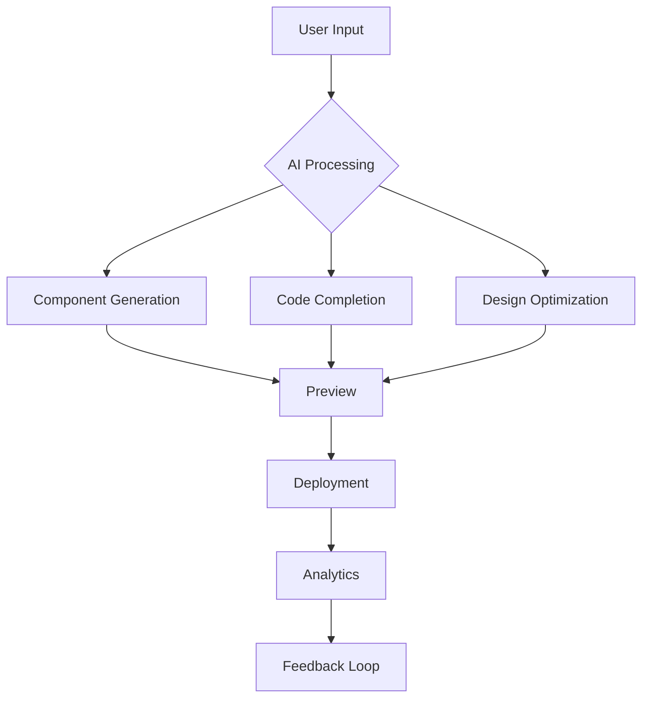

### Creation AI README.md (Advanced Version)

---

# **Creation AI :artificial_intelligence:**

<p align="center">
  <a href="https://creation.v4os.org">
    
  </a>
</p>

<p align="center">
  <em>Elevating web development with AI-driven innovation :rocket:</em>
</p>

<p align="center">
  <a href="https://github.com/v4os/Creation-Ai/stargazers">
    
  </a>
  <a href="LICENSE">
    
  </a>
  <a href="https://github.com/v4os">
    
  </a>
</p>

---

## 🌟 Vision

Creation AI redefines modern web development by empowering developers with cutting-edge AI tools. Built on a foundation of innovation, it integrates seamlessly with frameworks like Next.js, React, Vue, and more. Creation AI is the future of code generation, design-to-code, and development workflows, delivered with flexibility and scalability.

---

## 🎯 Why Creation AI?

Our platform stands out by combining the power of multiple AI models and frameworks, offering:

- **Advanced AI Integration**: Leverages DeepSeek, HuggingFace, and Claude Anthropic for enhanced code generation and optimization.
- **Framework Flexibility**: Works seamlessly with React, Vue, Angular, Svelte, and more.
- **Community-DrivenDevelopment**: Open-source with active contributions from the global developer community.
- **Enterprise-Grade Features**: Robust security, collaboration tools, and analytics for teams of all sizes.

---

## 🚀 Core Features

### 1. AI-Powered Development
```typescript
{
  componentGeneration: {
    fromDescription: true,
    fromImages: true,
    multiFrameworkSupport: ["React", "Vue", "Angular", "Svelte"],
    customizationOptions: true
  },
  codeCompletion: {
    advancedContextAwareness: true,
    performanceOptimization: true,
    securityChecks: true
  },
  designIntelligence: {
    brandGuidelinesCompliance: true,
    responsiveLayouts: true,
    accessibilityFirst: true
  }
}
```

### 2. Advanced Playground
- **Interactive Development Environment**
  - Real-time component preview
  - Multi-device testing
  - Performance metrics tracking
  - Accessibility checker
- **AI-Powered Pair Programming**
  - Context-aware code suggestions
  - Architecture recommendations
  - Technical debt detection

### 3. Enterprise Features
```typescript
{
  teamCollaboration: true,
  designSystemManagement: true,
  versionControlIntegration: true,
  roleBasedAccessControl: true
}
```

---

## 🛠️ Technical Architecture

### Frontend Stack
```typescript
// Utilizes Next.js 14 with advanced features
import { AppRouter } from './AppRouter';

// Modern UI and Experience Layer
import {
  CreateComponent,
  Playground,
  AIAssistant
} from '@creation/ui';

// Performance Optimization
import {
  useCache,
  useLazyLoad
} from '@creation/performance';
```

### AI Integration Layer
```typescript
// HuggingFace Integration
import { HuggingFace } from '@creation/ai';

// DeepSeek Integration
import { DeepSeek } from '@creation/ai';

// Claude Anthropic Integration
import { Claude } from '@creation/ai';
```

### Development Workflow


---

## 🌐 Platform Architecture

### Backend Services
```typescript
{
  apiGateway: "AWS API Gateway",
  authentication: "Auth0",
  aiProcessing: "DeepSeek & HuggingFace",
  database: "PostgreSQL",
  storage: "AWS S3"
}
```

### Microservices
```typescript
{
  aiService: true,
  componentGenerator: true,
  codeAnalyzer: true,
  designOptimizer: true
}
```

---

## 🎨 UI/UX Features

### Modern Design System
- **Fluid Typography**: Adaptive text sizing for all devices.
- **Dynamic Theming**: Customizable color palettes and themes.
- **Motion Design**: Smooth animations and transitions.
- **Accessibility**: WCAG 2.1 compliance by default.

### Component Library
- **Atomic Design**: Build components from small to large.
- **Composition API**: Combine components seamlessly.
- **Theme Engine**: Customizable styling across your project.

---

## 🤝 Partnerships & Integrations

### AI Partners
<div style="display: flex; justify-content: center; gap: 20px; margin: 20px 0;">
  <div style="text-align: center;">
    <a href="https://beta.deeplang.io">
      
    </a>
    <p>Advanced Code Generation</p>
  </div>
  <div style="text-align: center;">
    <a href="https://huggingface.co">
      
    </a>
    <p>State-of-the-art ML Models</p>
  </div>
  <div style="text-align: center;">
    <a href="https://www.cohere.ai">
      
    </a>
    <p>Advanced Language Models</p>
  </div>
</div>

---

## 📚 Documentation

### Getting Started
1. **Installation**: 
```bash
git clone https://github.com/v4os/creation-ai.git
cd creation-ai
pnpm install
```
2. **Development**: 
```bash
pnpm dev
```
3. **Building**: 
```bash
pnpm build
```

### API Reference
- **Component Generation**: 
[Documentation](https://docs.creation.v4os.org/component-generation)
- **Code Completion**: 
[Documentation](https://docs.creation.v4os.org/code-completion)

---

## 🎯 Roadmap

### Q2 2024
- Advanced component templates
- Multi-language support
- AI-assisted debugging and testing

### Q3 2024
- Full-stack AI support
- Server-side rendering optimization
- Cloud deployment integrations

### Q4 2024
- Extended enterprise features
- Global developer community platform
- AI-driven performance analytics

---

## 🤝 Contributing

Contributions are welcome! Check out our [Contributing Guidelines](CONTRIBUTING.md) for details on how to get started.

---

## 📁 Project Structure

```
creation-ai/
├── apps/
│   ├── web/          # Frontend application
│   ├── api/          # Backend services
│   ├── studio/       # Development environment
│   └── docs/          # Documentation
├── packages/
│   ├── ai/          # AI service integration
│   ├── ui/          # UI components
│   └── core/         # Core utilities
└── infrastructure/   # Infrastructure as code
```

---

## 🤝 Leadership

<div align="center">
  <div style="display: flex; align-items: center; gap: 20px; margin: 20px 0">
    
    <div>
      <h3>Likhon Sheikh</h3>
      <p>CEO & Founder of DELTA @ V4OS</p>
      <p style="color: #0366d6; margin-top: 10px">
        📧 <a href="mailto:likhon@delta.org">likhon@delta.org</a> | 
        📧 <a href="mailto:sheikh@v4os.org">sheikh@v4os.org</a> | 
        🌐 <a href="https://likhonsheikh.com">likhonsheikh.com</a> | 
        <a href="https://github.com/likhonsheikh54">
           
          @likhonsheikh54
        </a>
      </p>
    </div>
  </div>
</div>

---

## 📜 License

This project is licensed under the MIT License - see the [LICENSE](LICENSE) file for details.

---

## 🌐 Links

- **Homepage**: [creation.v4os.org](https://creation.v4os.org)
- **Documentation**: [docs.creation.v4os.org](https://docs.creation.v4os.org)
- **GitHub**: [github.com/v4os/creation-ai](https://github.com/v4os/creation-ai)
- **Community**: [discord.gg/creation-ai](https://discord.gg/creation-ai)

---

### Acknowledgments

- **DeepSeek AI**: For providing advanced code generation and optimization.
- **HuggingFace**: For state-of-the-art machine learning models.
- **GitHub Copilot**: For seamless integration and collaboration.
- **Claude Anthropic**: For cutting-edge AI language models.

---

_Made with ❤️ by VΔOS. Building the future of AI-powered web development._

---

### Final Notes

This README is designed to be the ultimate guide to Creation AI, showcasing its advanced features, integrations, and community-driven approach. The platform is built to empower developers and teams with the tools needed to build the next generation of web applications, powered by AI.
